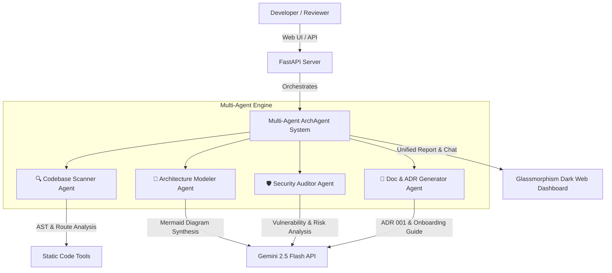

# ⚡ ArchAgent — Autonomous Codebase Architecture & Technical Documentation AI

[](https://github.com/cloud-gtm/bharathramh-5d-ai)
[](https://aistudio.google.com)
[](https://deepmind.google)
[](LICENSE)

**ArchAgent** is an enterprise-grade multi-agent AI system built with the **Google Antigravity SDK** and **Gemini 2.5**. It automates static codebase inspection, synthesizes interactive Mermaid.js architecture diagrams, drafts formal Architecture Decision Records (ADRs), audits code security, and provides an interactive "Chat with your Architecture" assistant.

---

## 🎯 Problem & Solution Statement

### The Problem
When joining a new engineering team or maintaining legacy systems, understanding codebase architecture, component dependencies, and security posture takes hours or days of manual code digging. Technical documentation and Architecture Decision Records (ADRs) quickly become stale, leading to poor developer onboarding and architectural drift.

### The Solution
**ArchAgent** solves this by dispatching a team of specialized AI subagents to analyze any repository in seconds:
1. **Static Inspection Agent**: Scans line metrics, AST import trees, framework routes, and potential security leaks.
2. **Architecture Modeler Agent**: Synthesizes live Mermaid.js component and sequence diagrams.
3. **Security & Audit Agent**: Identifies architectural risks, missing validations, and compliance recommendations.
4. **Doc & ADR Generator**: Drafts formal Architecture Decision Records (ADRs), system specifications, and step-by-step developer onboarding guides.
5. **Interactive Architecture Assistant**: Allows developers to ask questions directly about the codebase design patterns.

---

## 🏗️ Multi-Agent System Architecture



---

## ✨ Key Features

- **⚡ Instant Codebase Ingestion**: Evaluates file trees, language distributions, line counts (LOC), and API route definitions.
- **📐 Interactive Mermaid.js Diagrams**: Generates dynamic component flowcharts and sequence diagrams rendered natively in the browser.
- **📜 Automatic ADR 001 & Spec Generation**: Produces ready-to-commit Architecture Decision Records and onboarding documentation.
- **🛡️ Security & Secret Scanner**: Scans for hardcoded secrets, shell injection vulnerabilities, and risky dynamic executions.
- **💬 "Chat with your Architecture"**: Interactive Q&A chat subagent trained on the live inspection context of your repository.
- **🎨 Glassmorphism Web Interface**: Sleek, responsive dark-mode UI with live multi-agent execution pipeline tracking.

---

## 🚀 Quickstart & Setup Guide

### 1. Prerequisites
- Python 3.10+
- A Google Gemini API Key ([Get one at Google AI Studio](https://aistudio.google.com/app/api-keys))

### 2. Installation
```bash
# Clone the repository
git clone git@github.com:cloud-gtm/bharathramh-5d-ai.git
cd bharathramh-5d-ai

# Create virtual environment
python3 -m venv .venv
source .venv/bin/activate

# Install dependencies
pip install -r requirements.txt
```

### 3. Environment Setup
Create a `.env` file in the root directory:
```bash
GEMINI_API_KEY="your-gemini-api-key-here"
```

### 4. Run the Web Application
```bash
python main.py
```
Open **`http://localhost:8000`** in your browser to launch the ArchAgent Web Dashboard!

---

## 📽️ Video Demonstration & Submission

- **Problem & Solution**: Automated Codebase Architecture & Technical Documentation Agent
- **Track**: Enterprise Agents
- **GitHub Repository**: [cloud-gtm/bharathramh-5d-ai](https://github.com/cloud-gtm/bharathramh-5d-ai)
- **Demo Video**: *(Add your short video link here when submitting)*

---

## 📄 License
MIT License. Created for the 5-Day AI Agent Build Challenge.
